# AudioBridge-Pi データフロー図

## システム全体データフロー概要

AudioBridge-Pi は、Bluetooth A2DP → 音声処理 → WiFi HTTP配信の一方向データフローを基本とする、リアルタイム音声ストリーミングシステムです。

## 1. 高レベルシステムフロー

### 音声データフロー全体像
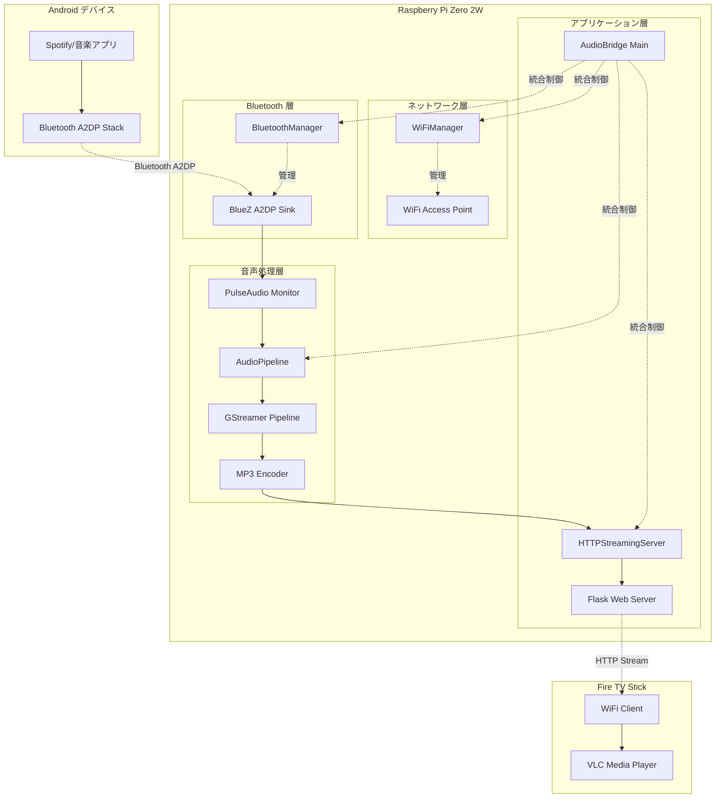

### システム状態遷移フロー
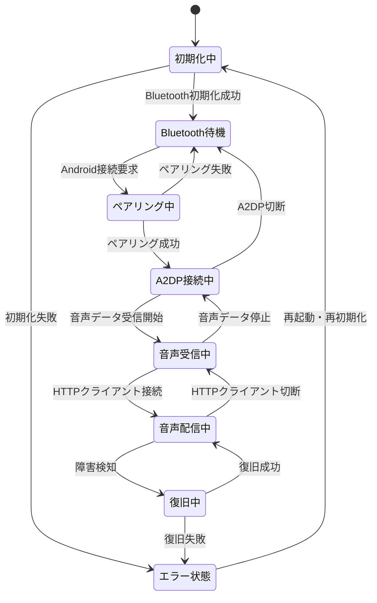

## 2. 音声データパイプライン詳細

### リアルタイム音声処理フロー
```mermaid
flowchart LR
    subgraph Input["音声入力"]
        I1[Android Audio Output]
        I2[Bluetooth A2DP Transport]
        I3[SBC Decode]
    end
    
    subgraph BlueZStack["BlueZ処理"]
        B1[A2DP Sink Profile]
        B2[Audio Routing]
        B3[PulseAudio Bridge]
    end
    
    subgraph PulseAudio["PulseAudio層"]
        P1[bluez_sink Device]
        P2[Monitor Source]
        P3[Audio Buffer]
    end
    
    subgraph GStreamer["GStreamer パイプライン"]
        G1[pulsesrc Element]
        G2[audioconvert]
        G3[audioresample]
        G4[lamemp3enc]
        G5[fdsink]
    end
    
    subgraph Output["HTTP出力"]
        O1[Flask Response]
        O2[Chunked Transfer]
        O3[Fire TV VLC]
    end
    
    I1 --> I2 --> I3 --> B1
    B1 --> B2 --> B3 --> P1
    P1 --> P2 --> P3 --> G1
    G1 --> G2 --> G3 --> G4 --> G5
    G5 --> O1 --> O2 --> O3
```

### バッファリング戦略
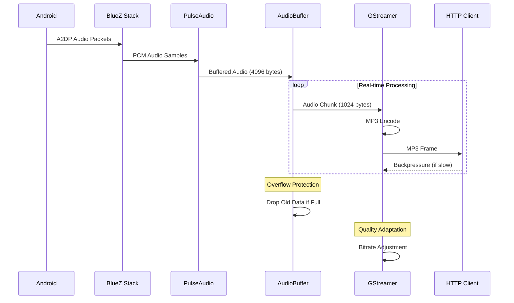

## 3. ネットワーク通信フロー

### WiFi Access Point セットアップフロー
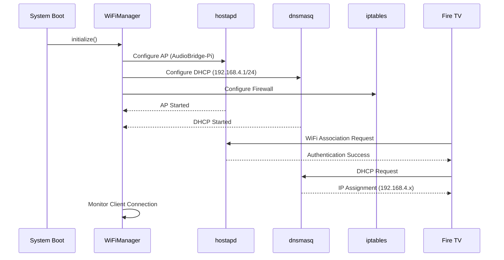

### HTTP音声ストリーミングフロー
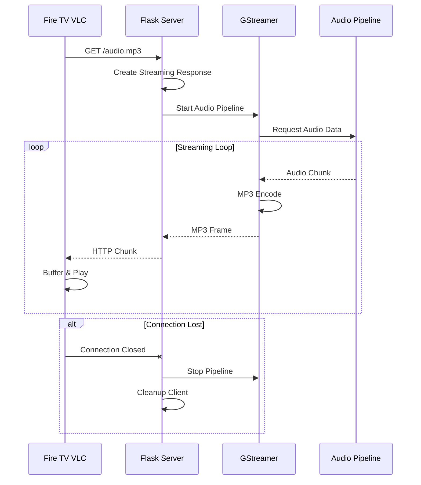

## 4. システム管理・監視フロー

### 統合システム制御フロー
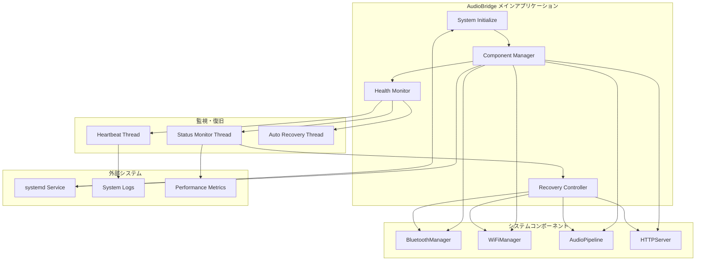

### 障害検知・復旧フロー
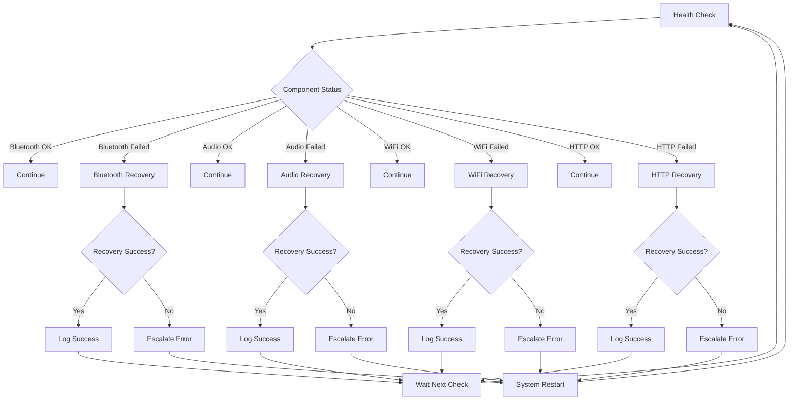

## 5. 起動・初期化シーケンス

### システム起動フロー
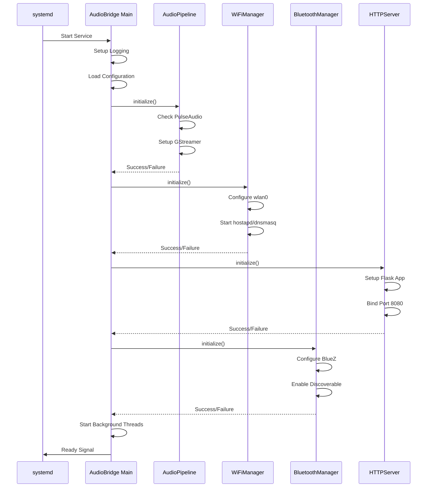

### 接続確立フロー
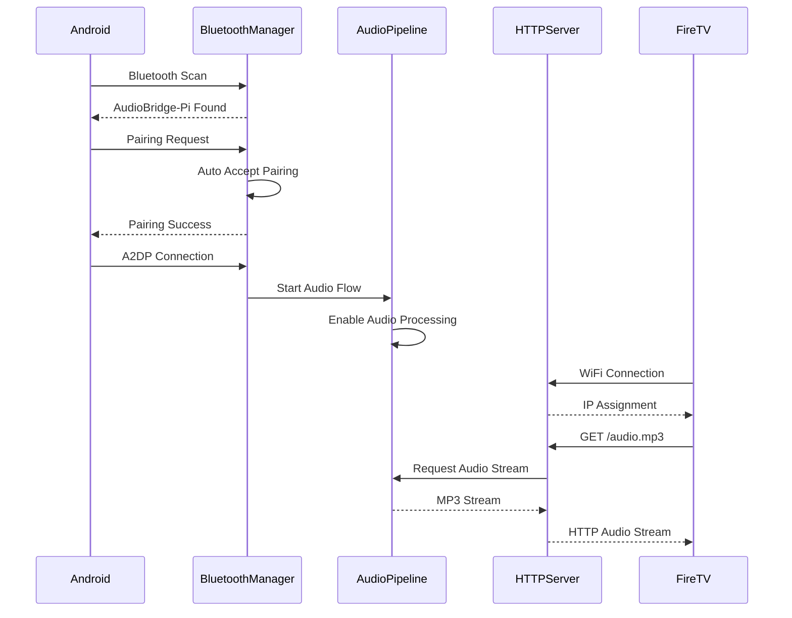

## 6. エラーハンドリング・フォールバックフロー

### 音声パイプライン障害対応
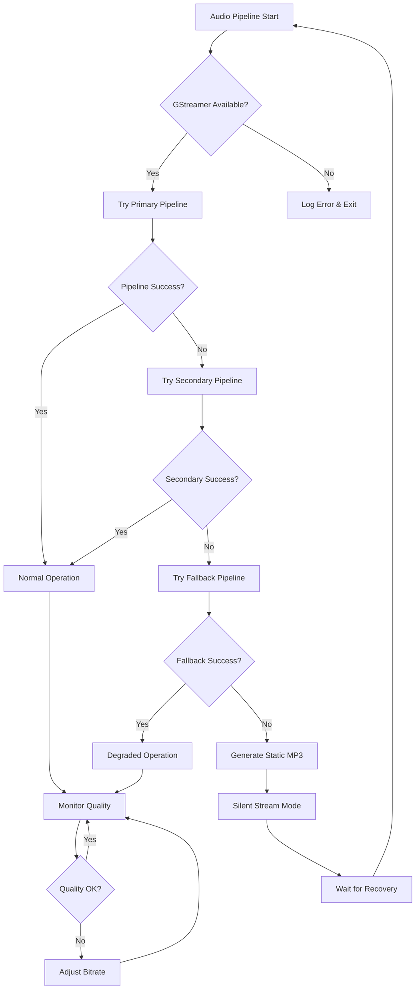

### ネットワーク障害復旧フロー
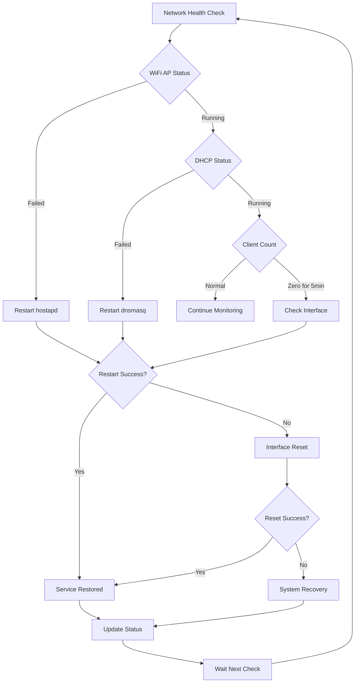

## 7. パフォーマンス・品質監視フロー

### 音声品質監視
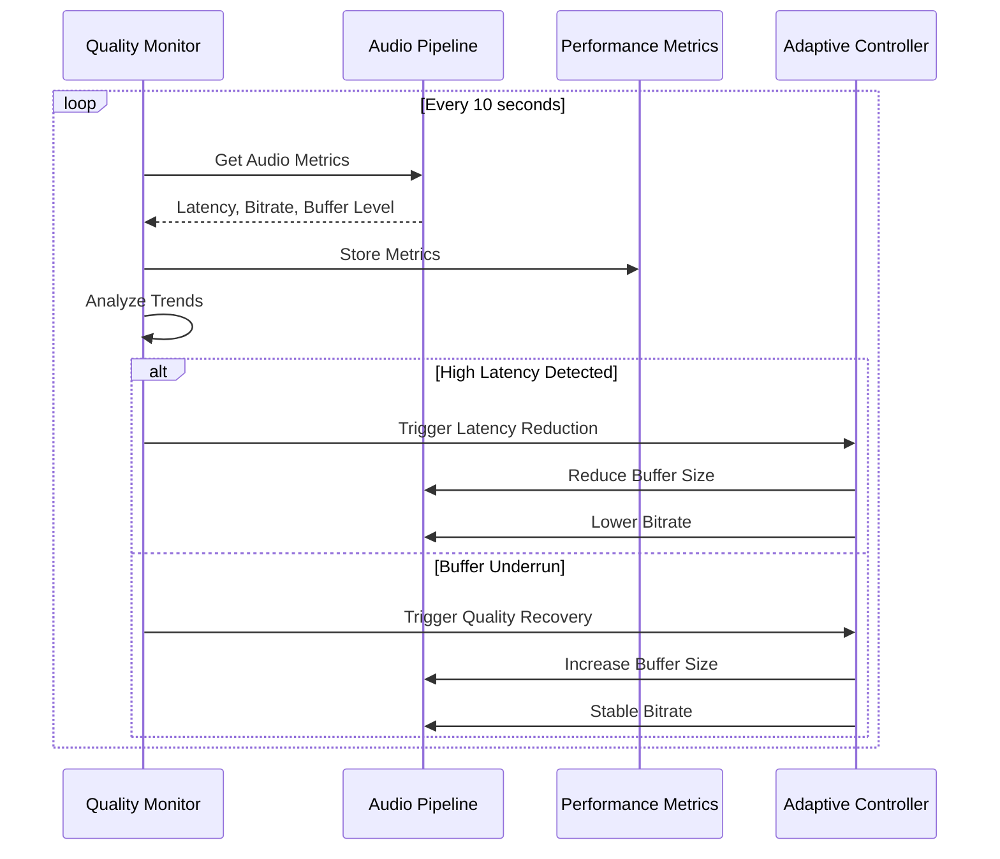

### システムリソース監視
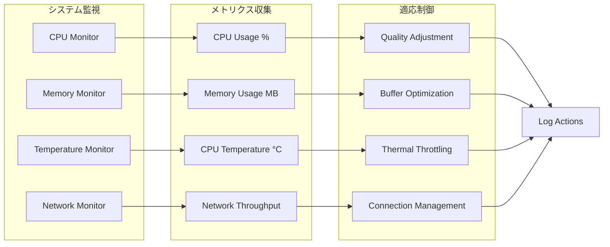

---

**データフロー設計確認事項**:
- ✅ リアルタイム音声処理の低遅延パイプライン
- ✅ 堅牢な障害検知・自動復旧機構
- ✅ 適応的品質制御による安定配信
- ✅ システムリソース制約下での最適化
- ✅ エンドツーエンドでの統合データフロー